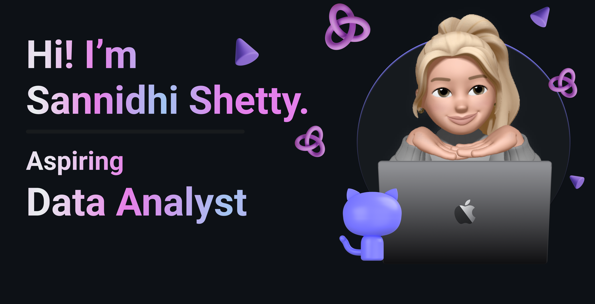

<!-- ================= HEADER ================= -->

  

  <h1>Sannidhi Shetty</h1>
  <h3>Data Analyst | SQL • Python • Business Intelligence</h3>
  
<em>Turning data into actionable business insights</em>

<!-- ================= ABOUT ME ================= -->
<table>
<!--
<tr>
<td width="30%" align="center">
  
</td>
-->
<td width="70%">
  <h2>👩‍💻 Professional Profile</h2>
  

    Data Analyst with hands-on experience in <b>data cleaning, exploratory data analysis,
    SQL querying, and dashboard development</b>. Skilled at analyzing large datasets,
    identifying trends, and translating findings into clear insights for business
    decision-making.
  

  

    Strong foundation in <b>Python, SQL, Power BI, and Excel</b> with a focus on
    performance tracking, reporting automation, and data-driven strategy.
  

</td>
</tr>
</table>

<!-- ================= SKILLS ================= -->
<h2>🧠 Analytical Skill Set</h2>
<ul>
  <li>Data Cleaning & Transformation</li>
  <li>Exploratory Data Analysis (EDA)</li>
  <li>SQL Queries & Data Extraction</li>
  <li>Dashboard Design & KPI Tracking</li>
  <li>Statistical Analysis</li>
</ul>

<!-- ================= TOOLS ================= -->
<h2>🛠 Tools & Technologies</h2>

  <b>Languages:</b> SQL, Python 
  <b>Visualization:</b> Power BI, Excel (Advanced) 
  <b>Libraries:</b> Pandas, NumPy, Matplotlib, Seaborn 
  <b>Databases:</b> MySQL 
  <b>Version Control:</b> Git, GitHub

<!-- ================= PROJECTS ================= -->
<h2>📊 Featured Analytical Projects</h2>

<h3>🎬 Netflix Data Analysis Dashboard</h3>
<ul>
  <li>Performed exploratory data analysis on Netflix content dataset</li>
</ul>

<h3>📦 Retail Demand Forecasting</h3>
<ul>
  <li>Cleaned and analyzed retail sales data to identify demand patterns</li>
  <li>Built predictive insights to support inventory planning</li>
  <li>Improved sales trend visibility through analytical reporting</li>
</ul>

<h3>🎥 Movie Recommendation System</h3>
<ul>
  <li>Developed a content-based recommendation system using Python</li>
  <li>Applied similarity techniques to improve recommendation accuracy</li>
  <li>Demonstrated applied analytics and machine learning concepts</li>
</ul>

<!-- ================= GITHUB STATS ================= -->

<!-- ================= LEARNING ================= -->
<h2>🎯 Currently Focused On</h2>
<ul>
  <li>Advanced SQL (CTEs, Window Functions)</li>
  <li>DAX & advanced Power BI dashboards</li>
  <li>Real-world business analytics case studies</li>
</ul>

<!-- ================= CONTACT ================= -->

  <h2>📬 Connect With Me</h2>

  

    📧 Email:
    <a href="mailto:sannidhishetty871@gmail.com">
      sannidhishetty871@gmail.com
    </a>
  

  

    💼 LinkedIn:
    <a href="https://www.linkedin.com/in/sannidhishetty2206" target="_blank" rel="noopener noreferrer">
      linkedin.com/in/sannidhishetty2206
    </a>
  

  

    💻 GitHub:
    <a href="https://github.com/sannidhishetty345" target="_blank" rel="noopener noreferrer">
      github.com/sannidhishetty345
    </a>
  

  <b>“Data is valuable only when transformed into insight.”</b>

